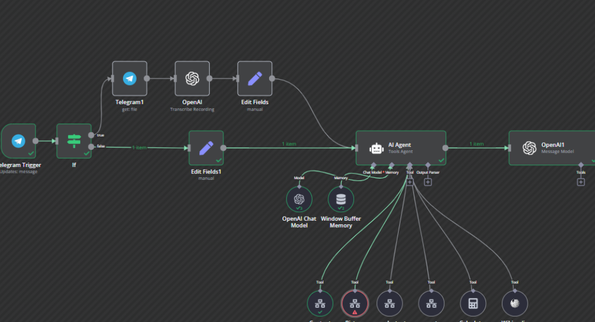

# :rocket: Metaproyecto, edición y gestión de Agentes de IA

---

- [:rocket: Metaproyecto, edición y gestión de Agentes de IA](#rocket-metaproyecto-edición-y-gestión-de-agentes-de-ia)
  - [:computer: 1. Proyecto Intefaz Web: Editor de Nodos](#computer-1-proyecto-intefaz-web-editor-de-nodos)
  - [🖤 2. Proyecto de Backend para creación y ejecución de Agentes](#-2-proyecto-de-backend-para-creación-y-ejecución-de-agentes)
  - [🔃 3. Proyectos de Integración de Nodos (Frontend y Backend)](#-3-proyectos-de-integración-de-nodos-frontend-y-backend)
  - [🏗️ 7. Tecnologías y recursos](#️-7-tecnologías-y-recursos)
- [Casos de uso basicos de Agentes de IA](#casos-de-uso-basicos-de-agentes-de-ia)
- [Análisis DAFO](#análisis-dafo)
  - [Conclusión DAFO:](#conclusión-dafo)
- [Encaje de módulos de FP y cursos](#encaje-de-módulos-de-fp-y-cursos)
  - [📚 DAM y DAW, 1º](#-dam-y-daw-1º)
  - [🖥️ DAM, 2º](#️-dam-2º)
  - [🌐 DAW, 2º](#-daw-2º)
  - [🛠️ ASIR](#️-asir)
  - [⚙️ Resumen: Encaje por perfil y curso](#️-resumen-encaje-por-perfil-y-curso)

A continuación, se plantea una conjunto de proyectos independientes pero interrelacionados en torno a la idea principal: un **Editor de nodos para la creación y gestión de Agentes de IA**. De esta manera, cada grupo de desarrollo (o cada especialidad de Formación Profesional) puede responsabilizarse de una parte diferente fomentando la colaboración entre equipos y modulos.

Por lo tanto hay que **dividir el desarrollo en varios proyectos** interrelacionados y además hacerlo con bajo acoplamiento para facilitar la integración de futuros proyectos. Este es tal vez el mayor reto a nivel de diseño.

La idea final es que este metaproyecto sirva de plataforma educativa que abarca distintos perfiles (desarrollo web, multi, backend, IA, administración de sistemas). 

Cada equipo de estudiantes se encargará de una parte específica del proyecto, pero todos ellos estarán interconectados. La idea es que cada grupo pueda trabajar de forma independiente en su parte, pero que al final todo funcione como un sistema cohesionado. 

Es especialmente interesante para los alumnos de FP que puedan ver cómo se integran sus proyectos con los de otros compañeros, y cómo cada uno aporta su granito de arena al resultado final y eso es motivador además de que si todo va bien, el resultado final es un producto que puede ser útil para el centro.

Ejemplo de definición de un agente:

---

## :computer: 1. Proyecto Intefaz Web: Editor de Nodos

**Objetivo:**  
Desarrollar la aplicación que permita a los usuarios diseñar y visualizar el flujo de trabajo de los agentes de IA mediante la creación y conexión de nodos.  
- **Stack sugerido:** Vue + [BaklavaJS](https://github.com/newcat/baklavajs).  
- **Responsabilidades clave:**  
  1. **Interfaz gráfica (UI):** Diseño de la estructura de nodos, puertos y conexiones (drag & drop).  
  2. **Gestión de diagramas:** Guardar, cargar, versionar y compartir diagramas de flujo.  
  3. **Configuración de nodos:** Pantallas modales o paneles de propiedades para definir parámetros (por ejemplo, URL de la IA, credenciales, umbrales, etc.).  
  4. **Exportación/Importación de nodos:** Para que otros proyectos (backend o integraciones) puedan interpretar y ejecutar los flujos creados.  
   
**Metas educativas:**  
- Diseñar interfaces web responsivas.  
- Manejar la librería BaklavaJS.  
- Aprender a estructurar y modularizar un proyecto de frontend en Vue.  
- Profundizar en la comunicación con APIs externas.

## 🖤 2. Proyecto de Backend para creación y ejecución de Agentes

**Objetivo:**  
Desarrollar la capa de servidor responsable de:  
- Interpretar la configuración de los flujos creados en el editor de nodos.  
- Orquestar y ejecutar la secuencia de nodos (conexiones, decisiones, condiciones).  
- Almacenar y gestionar los resultados de las ejecuciones de los agentes.

**Responsabilidades clave:**  
1. **Recepción de diagramas o configuraciones:**  
   - Endpoint que reciba el diagrama exportado desde el Editor de Nodos.  
   - Parsear el flujo de trabajo y traducirlo a una secuencia de pasos ejecutables.  

2. **Gestión de la ejecución de los agentes:**  
   - Coordenar la ejecución nodo por nodo, siguiendo el orden y las condiciones establecidas.  
   - Control de estados (pendiente, en proceso, finalizado, error).  
   - Manejo de errores y reintentos.  

3. **Almacenamiento de resultados e historiales:**  
   - Registrar logs de ejecución y outputs generados por cada nodo.  
   - Mantener un historial de todas las ejecuciones y agentes versionados.  

4. **Posible escalado con microservicios:**  
   - Cada tipo de nodo podría tener un microservicio dedicado.  
   - Orquestación a través de colas (RabbitMQ, Kafka) o llamadas REST.  

5. **Autenticación y seguridad:**  
   - Para agentes sensibles, se manejan credenciales con un sistema seguro (vaults, OAuth, etc.).  

**Metas educativas:**  
- Profundizar en el desarrollo backend con Java, Node, Python (FastAPI, Flask), según el plan de estudios.  
- Aprender patrones de orquestación de procesos y pipelines de datos.  
- Manejar diferentes tipos de bases de datos y almacenamiento (SQL, NoSQL, ficheros).  
- Integrar CI/CD y despliegues escalables (Docker, IsardVDI, AWS).  

## 🔃 3. Proyectos de Integración de Nodos (Frontend y Backend)

**Objetivo:**  
Implementar de forma modular y desacoplada los diferentes tipos de nodos que se pueden utilizar en el editor, de modo que cada uno represente un servicio o recurso específico (texto, fichero, imagen, audio, video, etc.).  

1. **Nodo de Texto (NLP):**  
   - Integración con servicios de NLP (APIs de OpenAI, Hugging Face, etc.)  
   - Funciones de análisis de sentimiento, generación de texto, clasificación de intenciones…  

2. **Nodo de Fichero (Documento):**  
   - Manejo de PDFs, DOCX, TXT y conversiones (OCR en caso de PDF escaneados).  
   - Posible uso de librerías específicas (Tika, PyPDF2, etc.).  

3. **Nodo de Imagen:**  
   - Integración con APIs de reconocimiento de objetos o rostros (AWS Rekognition, Google Vision, servicios on-premise con OpenCV).  

4. **Nodo de Audio:**  
   - Transcripción (Speech-to-Text) e incluso síntesis de voz (Text-to-Speech).  
   - Posible uso de Google Speech, IBM Watson o soluciones open-source como Vosk.  

5. **Nodo de Video:**  
   - Extracción de frames y análisis (detección de objetos, escenas, tracking).  
   - Integración con servicios especializados o frameworks de visión por computador en local.  

**Estrategia de bajo acoplamiento:**  
- Cada tipo de nodo se implementa como un **paquete, plugin o microservicio** con su propia API.  
- La definición de cada nodo podría seguir un **contrato común** (por ejemplo, un JSON con la configuración).  
- El editor de nodos llama a un método general (p. ej. `executeNode(nodeConfig, inputData)`) sin conocer los detalles internos de la IA.  

**Metas educativas:**  
- Fomentar la capacidad de integrar diferentes servicios de IA o librerías especializadas.  
- Aprender el diseño de APIs y la separación de responsabilidad (SRP).  
- Permitir que distintos grupos trabajen simultáneamente en la creación de nuevos nodos o la mejora de los existentes.  

## 🏗️ 7. Tecnologías y recursos

1. **BaklavaJS**:  
   - [GitHub oficial](https://github.com/newcat/baklavajs)  
   - Ejemplos y documentación para la creación de nodos personalizados.  

2. **Entorno de desarrollo Base con Vue + BaklavaJS**:  
   - [node_prompter (GitHub)](https://github.com/mikeldalmauc/node_prompter)  

3. **Servicios y librerías de IA**:  
   - OpenAI, Hugging Face, Google Cloud Vision, AWS Rekognition, IBM Watson, TensorFlow, PyTorch, etc.  

4. **Bases de datos y almacenamiento**:  
   - SQL (MySQL, PostgreSQL)  
   - NoSQL (MongoDB)  
   - Almacenamiento en la nube (AWS S3, Google Cloud Storage)  

5. **Arquitectura y despliegue**:  
   - Docker, AWS, IsardVDI.  
   - Mensajería (RabbitMQ, Kafka)  
   - Herramientas de CI/CD (GitLab, GitHub Actions)  

---

# Casos de uso basicos de Agentes de IA

1. **Clasificación Automática de Correos Electrónicos**
   - **Descripción**: Agente que analiza periódicamente la bandeja de entrada y clasifica automáticamente correos en categorías (urgente, trabajo, personal, spam) usando modelos de lenguaje.
   - **IA utilizada**: OpenAI GPT, Hugging Face.
   - **Ejecución**: Asíncrona, cada 5-10 minutos.

2. **Generación de Respuestas Automáticas para Soporte Técnico**
   - **Descripción**: Agente que recibe tickets de soporte, analiza su contenido, y propone respuestas automáticas basadas en documentación interna usando prompts.
   - **IA utilizada**: GPT-3.5, GPT-4 (uso moderado mediante prompts bien definidos).
   - **Ejecución**: Asíncrona al recibir un nuevo ticket.

3. **Resúmenes Diarios de Noticias**
   - **Descripción**: Agente que recopila titulares de diversas fuentes RSS, genera un resumen breve y personalizado usando prompts específicos para el usuario.
   - **IA utilizada**: GPT-3.5/4, Hugging Face modelos ligeros.
   - **Ejecución**: Diaria, durante la madrugada.

4. **Análisis de Opiniones en Formularios**
   - **Descripción**: Agente que procesa formularios enviados por usuarios (feedback, encuestas, satisfacción), categoriza respuestas abiertas usando prompts para clasificar en positivas, negativas o neutras.
   - **IA utilizada**: OpenAI GPT, Hugging Face modelos ligeros.
   - **Ejecución**: Asíncrona cuando llega un nuevo formulario.

5. **Traducción Automática de Documentos**
   - **Descripción**: Agente que detecta documentos cargados en una carpeta, realiza automáticamente traducciones usando prompts hacia múltiples idiomas según configuraciones del usuario.
   - **IA utilizada**: GPT-3.5 o API de traducción simple (Google Translate).
   - **Ejecución**: Asíncrona al detectar nuevos documentos.

6. **Generación Automática de Minutas de Reuniones**
   - **Descripción**: Agente que recibe notas o transcripciones breves de reuniones, extrae tareas pendientes, decisiones tomadas y genera una minuta ordenada.
   - **IA utilizada**: GPT-3.5, prompts estructurados.
   - **Ejecución**: Asíncrona tras finalizar una reunión (transcripción enviada por usuario).

7. **Curación de Contenido para Redes Sociales**
   - **Descripción**: Agente que monitoriza sitios web específicos, extrae contenido relevante, genera breves mensajes listos para publicar en redes sociales.
   - **IA utilizada**: GPT-3.5 con prompts predefinidos.
   - **Ejecución**: Diaria o semanal según preferencia del usuario.

8. **Extracción y Análisis de Información en PDFs**
   - **Descripción**: Agente que recibe documentos PDF (facturas, contratos), extrae automáticamente información clave (fechas, nombres, importes) mediante prompts específicos.
   - **IA utilizada**: GPT-3.5, prompts definidos para extracción estructurada.
   - **Ejecución**: Asíncrona al recibir documentos nuevos.

9. **Chatbot Asíncrono de Preguntas Frecuentes (FAQs)**
   - **Descripción**: Agente que recibe preguntas frecuentes por correo o formularios, genera respuestas usando prompts basados en documentación previamente cargada.
   - **IA utilizada**: GPT-3.5, GPT-4, documentos almacenados localmente.
   - **Ejecución**: Asíncrona al recibir consultas.
  
10. **Monitorización y Alerta en Foros y Redes Sociales**
    - **Descripción**: Agente que periódicamente busca menciones específicas en foros y redes sociales usando prompts, analiza contexto y envía alertas cuando detecta menciones importantes.
    - **IA utilizada**: GPT-3.5 con prompts para analizar contexto.
    - **Ejecución**: Periódica, por ejemplo cada hora.

---

# Análisis DAFO

Análisis DAFO del proyecto para un entorno educativo basado en la edición y gestión de Agentes de IA mediante nodos en un centro público de Formación Profesional:

| **Debilidades** (Internas)                                            | **Fortalezas** (Internas)                                         |
|------------------------------------------------------------------------|-------------------------------------------------------------------|
| - Complejidad inicial alta para estudiantes con poca experiencia técnica. | - Proyecto motivador y altamente interdisciplinar.              |
| - Riesgo de falta de coordinación entre grupos involucrados debido a la naturaleza modular. | - Potencia la colaboración y el trabajo en equipo entre especialidades. |
| - Dependencia significativa del profesorado para gestionar integración y seguimiento. | - Alineado con tendencias actuales en tecnologías de IA y desarrollo de software. |
| - Limitaciones en recursos técnicos o infraestructuras (computadores, servidores, acceso a APIs). | - Promueve el aprendizaje práctico y significativo.               |
| - Posible falta de tiempo para cubrir todas las partes del proyecto.   | - Permite integración real de proyectos finales de diferentes módulos de FP. |

| **Amenazas** (Externas)                                                 | **Oportunidades** (Externas)                                      |
|--------------------------------------------------------------------------|-------------------------------------------------------------------|
| - Cambios rápidos en tecnologías (versiones de APIs, frameworks), que obliguen a ajustes frecuentes. | - Creación de un producto real útil para el centro educativo (gestión interna, secretaría, comunicación). |
| - Coste económico o restricciones en el acceso a ciertas APIs de terceros (OpenAI, Google, etc.). | - Alta empleabilidad por formación en tecnologías emergentes.     |
| - Posible discontinuidad en la participación de estudiantes (cambios de curso o abandono). | - Fomento de colaboraciones con empresas locales o instituciones tecnológicas. |
| - Complejidad de gestión administrativa y burocrática del centro público para permisos o recursos. | - Posibilidad de participar en eventos educativos, concursos o ferias tecnológicas. |
| - Riesgo de incumplimiento de RGPD o privacidad en la gestión de datos utilizados. | - Generación de una comunidad técnica entre alumnos, ex-alumnos y profesorado del centro. |

## Conclusión DAFO:

Este proyecto presenta un gran potencial educativo y técnico, especialmente por su carácter integrador e interdisciplinar, alineado con las necesidades actuales de Formación Profesional. Las principales dificultades serán asegurar una buena coordinación, gestionar la complejidad inicial y garantizar acceso a recursos técnicos suficientes. Sin embargo, las oportunidades que ofrece, en términos de aprendizaje significativo, colaboración interdisciplinaria, y creación de un producto real aplicable en el propio centro educativo, hacen que el proyecto sea altamente recomendable y estratégico para su implantación.

# Encaje de módulos de FP y cursos

Aquí se presenta un encaje posible **de los módulos de FP y cursos** dentro del proyecto global propuesto. Se especifican áreas en las que podrían trabajar alumnos según la especialidad de **DAM, DAW y ASIR**.

---

## 📚 DAM y DAW, 1º

| Curso | Módulo | Encaje en el proyecto |
|-------|--------|-----------------------|
| 1º    | **Programación** |  Implementación básica de algoritmos y lógica de nodos; pruebas unitarias y simulaciones de ejecución de flujos simples. |
| 1º    | **Bases de datos** | Modelado inicial y gestión de bases de datos simples para guardar configuraciones de usuario (diagrama ER, NoSQL inicial). |
| 1º    | **Lenguajes de Marcas** | Desarrollo inicial de prototipos HTML/CSS para la interfaz web del editor de nodos. |
| 1º    | **Programación** | Implementación básica de algoritmos y lógica de nodos; pruebas unitarias y simulaciones de ejecución de flujos simples. |
| 1º    | **Bases de datos** | Diseño básico de estructuras de almacenamiento para guardar configuraciones de nodos y resultados (modelado ER, SQL). |
| 1º    | **Lenguajes de Marcas** | Documentación técnica, creación y mantenimiento de documentación web sobre el proyecto. |
| 1º    | **Entornos de Desarrollo** | Configuración inicial de entornos (Docker, Visual Studio Code, JetBrains IDEs, Git). |

## 🖥️ DAM, 2º

| Curso | Módulo | Encaje en el proyecto |
|-------|--------|-----------------------|
| 2º    | **Programación Multimedia y Dispositivos Móviles** | Implementación específica de nodos multimedia (audio, imagen, video) o interfaces móviles para ejecutar agentes. |
| 2º    | **Acceso a Datos** | Creación y gestión avanzada de APIs REST o GraphQL para la comunicación Backend-Frontend. |
| 2º    | **Servicios y Procesos** | Desarrollo de la lógica backend (Python, Java o Node.js) para orquestar ejecución secuencial y paralela de nodos/agentes. |
| 2º    | **Sistemas de Gestión Empresarial (SGE)** | Desarrollo de agentes orientados a procesos internos del centro (documentos, tareas administrativas, gestión de alumnos). |

## 🌐 DAW, 2º

| Curso | Módulo | Encaje en el proyecto |
|-------|--------|-----------------------|
| 2º    | **Desarrollo Web Entorno Cliente** | Desarrollo principal del frontend: Editor de nodos usando Vue y BaklavaJS, creación de componentes y UX/UI avanzado. |
| 2º    | **Desarrollo Web Entorno Servidor** | Integración del frontend con backend: desarrollo API REST, servicios asíncronos con Node.js o PHP, gestión de sesiones y autenticación. |
| 2º    | **Despliegue Aplicaciones Web** | Automatización de despliegue continuo con GitHub Actions o GitLab CI/CD, Dockerización y despliegue en entornos reales o virtualizados. |
| 2º    | **Diseño de Interfaces Web** | Diseño y evaluación avanzada de la experiencia de usuario (UX) del editor de nodos, incluyendo accesibilidad y usabilidad. |

## 🛠️ ASIR

| Curso | Módulo | Encaje en el proyecto |
|-------|--------|-----------------------|
| 1º    | **Implantación de Sistemas Operativos** | Instalación y configuración inicial de servidores para desarrollo, despliegue y gestión de infraestructura (Ubuntu Server, CentOS, Windows Server). |
| 1º    | **Fundamentos de Hardware y Redes** | Preparación y mantenimiento de la infraestructura física o virtualizada (IsardVDI, VMware, Proxmox). |
| 1º    | **Gestión de Bases de Datos** | Instalación, configuración y optimización de bases de datos (PostgreSQL, MySQL, MongoDB) en entornos de desarrollo y producción. |
| 1º    | **Lenguajes de Marcas** | Documentación de configuración de sistemas, entornos Docker, y creación de wikis técnicas sobre infraestructura. |
| 2º    | **Administración de Sistemas Operativos** | Gestión avanzada de servidores para el entorno de ejecución de agentes y despliegue del backend (actualizaciones, seguridad, automatización). |
| 2º    | **Servicios de Red e Internet** | Configuración y mantenimiento de servidores web y servidores de API (Apache/Nginx, Node.js, contenedores Docker). |
| 2º    | **Seguridad y Alta Disponibilidad** | Gestión de seguridad, cortafuegos, políticas RGPD, backup de configuraciones, monitorización (Prometheus, Grafana) y despliegue escalable con Docker, Kubernetes o AWS. |
| 2º    | **Implantación de Aplicaciones Web** | Despliegue, mantenimiento y monitorización continua del frontend y backend del proyecto, incluyendo automatización del despliegue CI/CD. |

---

## ⚙️ Resumen: Encaje por perfil y curso

| Especialidad | Principales áreas de responsabilidad |
|--------------|--------------------------------------|
| **DAM**      | Backend, orquestación de procesos, lógica interna de nodos/agentes, integración con servicios externos, integración con app móviles. |
| **DAW**      | Desarrollo del editor web de nodos (frontend), experiencia de usuario, API REST, despliegue de la aplicación web. |
| **ASIR**     | Infraestructura, despliegue de sistemas y servicios, seguridad, bases de datos, gestión continua del entorno y soporte técnico. |

[Ir al índice](#rocket-metaproyecto-edición-y-gestión-de-agentes-de-ia)